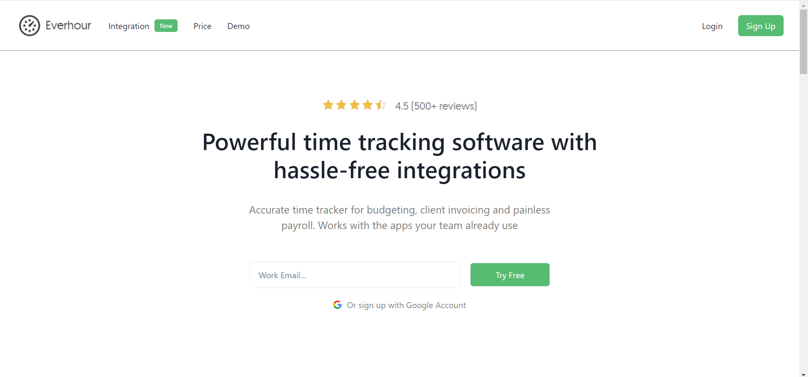
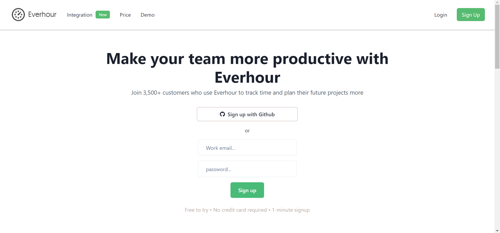
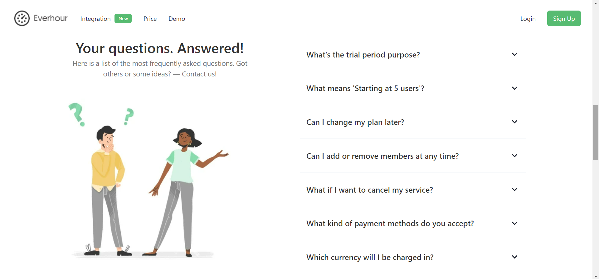
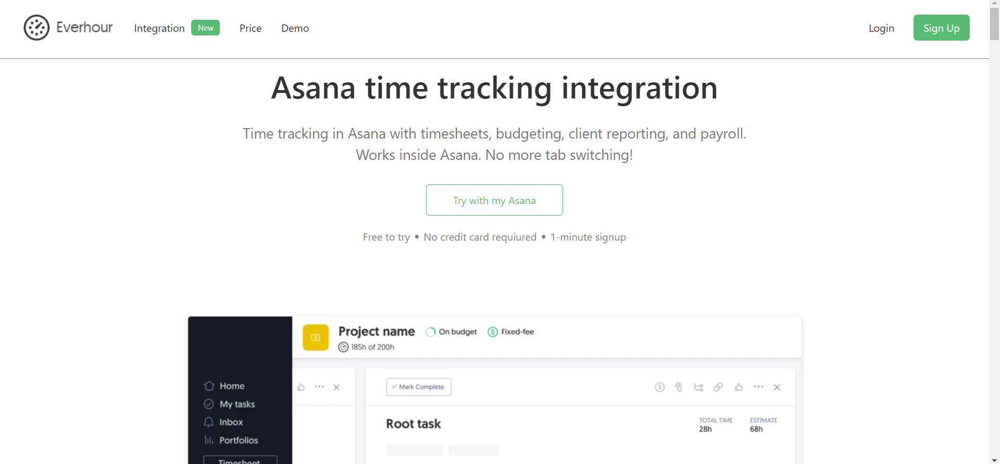

# “Everhour.com” Website Clone



### Ever Hour is a time management app, which helps their clients to improve time management.

This project is about building a web application to manage time while working on different platforms. 

## Technologies we used

[-20232A?style=for-the-badge&logo=react&logoColor=61DAFB>)](https://reactjs.org/)

[-593D88?style=for-the-badge&logo=redux&logoColor=white>)](https://redux.js.org/)

[](https://chakra-ui.com/)

[](https://www.npmjs.com/package/json-server)

[](https://styled-components.com/)

## 🚀 Features

- Landing Page
- Responsiveness for all screen sizes
- Pop modal and Toast notification
- Login/Signup User Account
- Login with Github
- Demo Page
- Price Page
- Integration Page

## 🚀 Our Team Members:-


- Shriram Deshpande

- Ashwini Prakash

- Komal Tiwari

- Faisal Khan


## Screenshots

#### Homepage -

This is the main landing page of our website. 

This page is functional and responsive.


#### Signup Page -

If the user clicks on the SignUp/login page. On this page, you can register a user. If the user is already registered, you can simply sign in by providing valid details of the user.




#### Price Page -

Here users can browse different packages.




#### Asana Integration -

here user can find on asana how he can do time management using Ever Hour services.



## Run Locally

Clone the project

```bash
  git clone https://github.com/shriram083/powerful-nut-6425.git
```

Go to the project directory

```bash
  cd powerful-nut-6425
  cd frontend
```

Install dependencies

```bash
  npm install
```

Start the localhost server

```bash
  npm start
```


## Or refer any one deployed link

### Netlify Link

[https://everhouver-clone-nem111.netlify.app/](https://everhouver-clone-nem111.netlify.app/)

